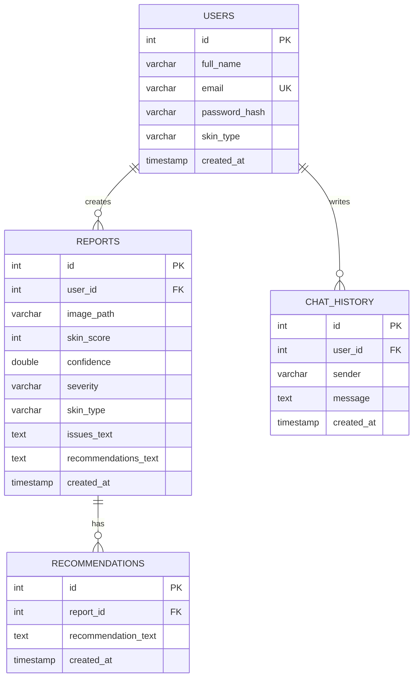

# ER Diagram

```mermaid
erDiagram
    USERS ||--o{ REPORTS : creates
    USERS ||--o{ CHAT_HISTORY : writes
    REPORTS ||--o{ RECOMMENDATIONS : has

    USERS {
        int id PK
        varchar full_name
        varchar email UK
        varchar password_hash
        varchar skin_type
        timestamp created_at
    }

    REPORTS {
        int id PK
        int user_id FK
        varchar image_path
        int skin_score
        double confidence
        varchar severity
        varchar skin_type
        text issues_text
        text recommendations_text
        timestamp created_at
    }

    CHAT_HISTORY {
        int id PK
        int user_id FK
        varchar sender
        text message
        timestamp created_at
    }

    RECOMMENDATIONS {
        int id PK
        int report_id FK
        text recommendation_text
        timestamp created_at
    }
```
