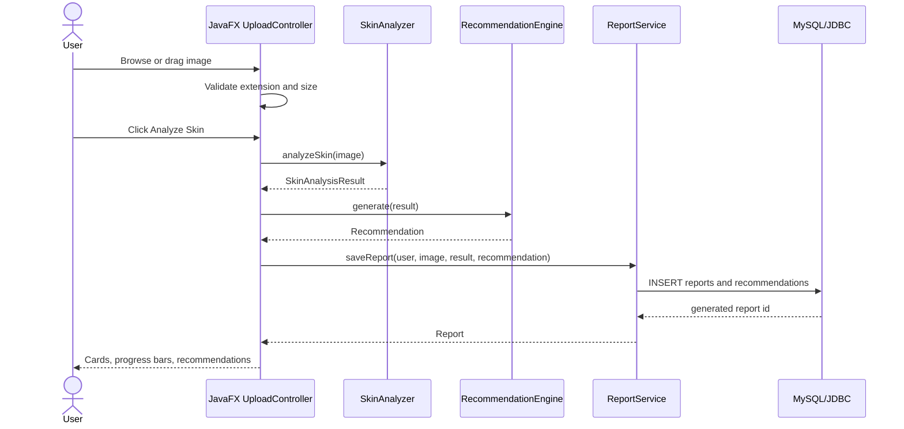

# Sequence Diagram

```mermaid
sequenceDiagram
    actor User
    participant UI as JavaFX UploadController
    participant Analyzer as SkinAnalyzer
    participant Engine as RecommendationEngine
    participant ReportService
    participant DB as MySQL/JDBC

    User->>UI: Browse or drag image
    UI->>UI: Validate extension and size
    User->>UI: Click Analyze Skin
    UI->>Analyzer: analyzeSkin(image)
    Analyzer-->>UI: SkinAnalysisResult
    UI->>Engine: generate(result)
    Engine-->>UI: Recommendation
    UI->>ReportService: saveReport(user, image, result, recommendation)
    ReportService->>DB: INSERT reports and recommendations
    DB-->>ReportService: generated report id
    ReportService-->>UI: Report
    UI-->>User: Cards, progress bars, recommendations
```
