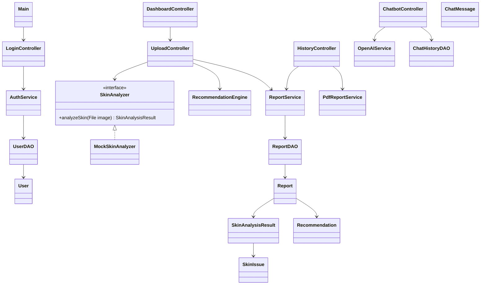

# UML Class Diagram

```mermaid
classDiagram
    class Main
    class LoginController
    class DashboardController
    class UploadController
    class ChatbotController
    class HistoryController
    class AuthService
    class SkinAnalyzer {
        <<interface>>
        +analyzeSkin(File image) SkinAnalysisResult
    }
    class MockSkinAnalyzer
    class RecommendationEngine
    class OpenAIService
    class ReportService
    class PdfReportService
    class UserDAO
    class ReportDAO
    class ChatHistoryDAO
    class User
    class Report
    class SkinAnalysisResult
    class SkinIssue
    class Recommendation
    class ChatMessage

    Main --> LoginController
    LoginController --> AuthService
    DashboardController --> UploadController
    UploadController --> SkinAnalyzer
    SkinAnalyzer <|.. MockSkinAnalyzer
    UploadController --> RecommendationEngine
    UploadController --> ReportService
    ChatbotController --> OpenAIService
    ChatbotController --> ChatHistoryDAO
    HistoryController --> ReportService
    HistoryController --> PdfReportService
    AuthService --> UserDAO
    ReportService --> ReportDAO
    UserDAO --> User
    ReportDAO --> Report
    Report --> SkinAnalysisResult
    Report --> Recommendation
    SkinAnalysisResult --> SkinIssue
```
