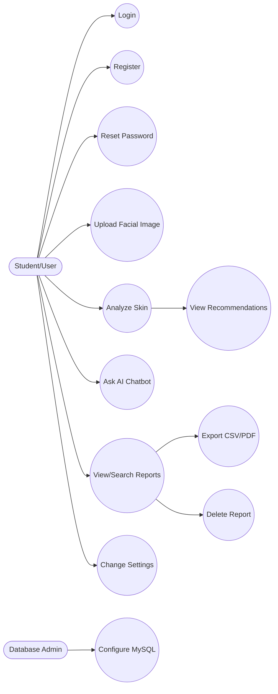

# Use Case Diagram

```mermaid
flowchart LR
    User([Student/User])
    Admin([Database Admin])

    Login((Login))
    Register((Register))
    Reset((Reset Password))
    Upload((Upload Facial Image))
    Analyze((Analyze Skin))
    Recommend((View Recommendations))
    Chat((Ask AI Chatbot))
    History((View/Search Reports))
    Export((Export CSV/PDF))
    Delete((Delete Report))
    Settings((Change Settings))
    DB((Configure MySQL))

    User --> Login
    User --> Register
    User --> Reset
    User --> Upload
    User --> Analyze
    Analyze --> Recommend
    User --> Chat
    User --> History
    History --> Export
    History --> Delete
    User --> Settings
    Admin --> DB
```
